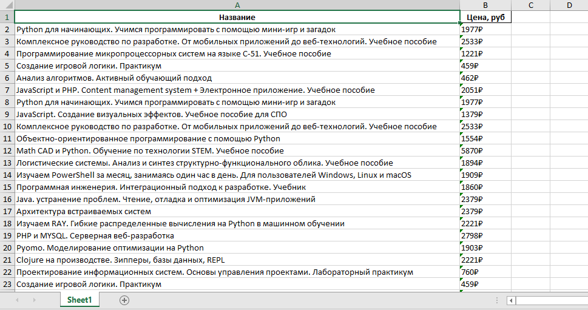

# 📚 Book Price Parser

Простой парсер книг с [Labirint.ru](https://www.labirint.ru/), написанный на Python.  
Собирает названия и цены книг и сохраняет результат в Excel.

## 🚀 Установка

1. Клонировать репозиторий:
   ```bash
   git clone https://github.com/USERNAME/book-parser.git
   cd book-parser


2. Установить зависимости:

   ```bash
   pip install -r requirements.txt
   ```

## ▶️ Запуск

```bash
python parser.py
```

После запуска данные сохраняются в файл `books.xlsx` в корне проекта.

## 📂 Пример результата

| Название книги                    | Цена |
| --------------------------------- | ---- |
| Мастер и Маргарита                | 450₽ |
| Преступление и наказание          | 520₽ |
| Гарри Поттер и философский камень | 700₽ |

## 🖼️ Скриншот



## 🛠️ Технологии

* Python 3.9+
* requests
* beautifulsoup4
* pandas
* openpyxl

## 📌 Возможные улучшения

* Сохранять не только цену и название, но и ссылку на книгу.
* Добавить многопоточность для ускорения.
* Сохранять данные сразу в базу (например, SQLite).

